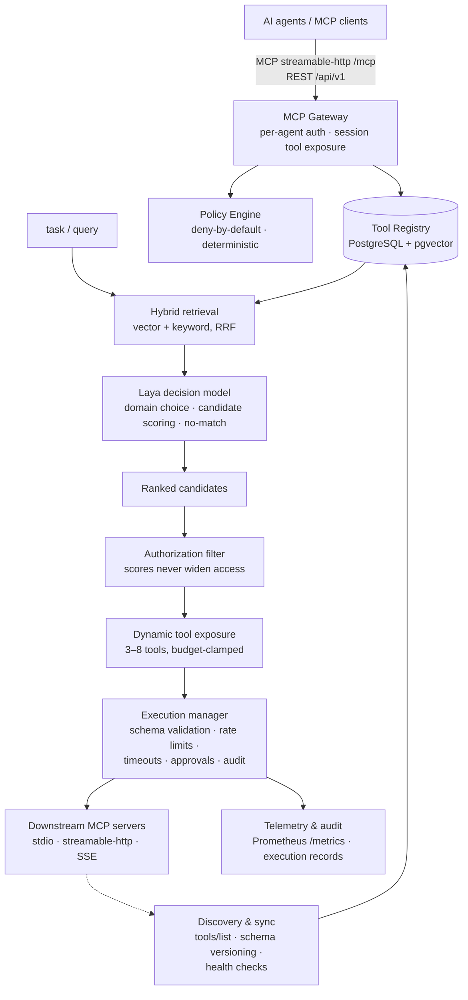

# MCP Router

**A local-first MCP management and intelligent routing platform.** It discovers,
catalogs, classifies and deduplicates every MCP server and tool you have — then
exposes each AI agent only the small, relevant, *authorized* subset it needs for
the task at hand, instead of flooding its context window with the whole catalog.

- **Decision engine:** [Laya](https://huggingface.co/convaiinnovations/laya) —
  a 421M non-autoregressive decision model (Apache 2.0) that answers typed
  Choice/Score/Noul questions with calibrated probabilities in a single forward
  pass. Because it can only *select among options supplied by deterministic
  code*, it structurally cannot invent tool names or execute anything.
- **Retrieval:** BGE-small embeddings in PostgreSQL + pgvector, fused with
  Postgres full-text keyword search (reciprocal-rank fusion).
- **Security:** a deterministic, deny-by-default policy engine and execution
  manager. Model scores are relevance data — they can never widen access.
- **Zero-ML fallback everywhere:** the entire stack runs with no torch
  installed (hash embeddings + lexical decision model), and any model failure
  or timeout degrades to deterministic retrieval ranking, flagged
  `fallback_used`.

Target hardware: a single laptop GPU (RTX 4060 Laptop, 8GB) with full CPU
fallback. Runs entirely offline; no external inference services.

## Architecture



### Routing pipeline (FR-03/FR-04)

```mermaid
sequenceDiagram
    participant Agent
    participant API as /api/v1/route
    participant Scope as Policy scope filter
    participant Ret as Hybrid retriever
    participant Laya
    participant Exec as Gateway /mcp

    Agent->>API: query (authenticated; agent_id = principal)
    API->>Scope: pre-filter: which servers/tools is this agent allowed?
    Scope-->>Ret: authorized scope only
    Ret-->>API: 10–20 candidates (vector ∪ keyword, RRF)
    API->>Laya: Choice: which domain? (only domains present)
    API->>Laya: Score each surviving candidate (batched)
    API->>Laya: Noul: does anything fit? → no_match gate
    API->>Scope: re-filter ranked list (defense in depth)
    API-->>Agent: top 3–8 tools + scores (+ fallback_used / no_match)
    Agent->>Exec: tools/list → exposed subset · call_tool → policy + validation + audit
```

A hierarchical cascade — never one big classification over the whole catalog.
Any model exception or deadline overrun falls back to deterministic retrieval
ranking; a sub-threshold "does anything fit?" probability returns an honest
`no_match` instead of garbage.

## Quickstart

```bash
docker compose up -d db                     # pgvector on :5434
uv venv --python 3.12 .venv
uv pip install -e '.[dev]'                  # zero-ML core
# optional, for real embeddings + Laya:
uv pip install -e '.[inference]'

export MCPR_ADMIN_TOKEN=$(openssl rand -hex 24)
export MCPR_AGENT_KEYS="my-agent:$(openssl rand -hex 24)"
.venv/bin/uvicorn --factory mcprouter.api.app:create_app --port 8400

cd ui && npm ci && npm run dev              # dashboard on :5180
```

Register servers via the dashboard or `POST /api/v1/servers` (admin token),
import an existing Claude-Desktop-style `mcpServers` config via
`POST /api/v1/servers/import`, then point your agent at `http://host:8400/mcp`
with its API key.

Want a synthetic fleet to play with? `python -m testbed.serve --servers 10`
spins up realistic MCP servers with overlapping tools across five domains.

## Status — honest ledger

| Verified (ran here, CPU) | Pending (needs the target GPU) |
|---|---|
| 631 backend + 26 UI tests green; e2e: discover → route → execute → audit | CUDA/FP16 paths (written, device-agnostic, unproven) |
| Laya 0.4.0 loaded on CPU: choice/score/noul with calibrated probs | <150ms warm routing p95 |
| 100 servers / 1,000 tools full refresh in 6.1s (target: <60s) | <4GB VRAM claim |
| Zero unauthorized executions across the adversarial test battery | Laya candidate-count tuning (score top-5 vs top-20) |
| 100+ security guards mutation-checked (break guard → named test fails) | |

The GPU validation runbook is [`docs/hardware-validation.md`](docs/hardware-validation.md).

## Security model

Authentication (per-agent API keys, hashed at rest) → deny-by-default policy
rules with `read < write < execute` ceilings (an unclassified tool counts as
`execute` — fail closed) → JSON-Schema argument validation → optional
human approval gates (single-use, expiring) → timeouts and per-agent rate
limits → an audit record for every attempt, including refusals. Secrets are
redacted before logs, audit rows and model inputs. Details:
[`docs/security-model.md`](docs/security-model.md).

> ⚠️ Registering a **stdio** server means the platform will run that command.
> Server registration is therefore admin-only and the admin API fails closed
> when no `MCPR_ADMIN_TOKEN` is configured. Don't expose the API beyond
> localhost without auth configured.

## Repository map

```
src/mcprouter/
  mcpclient/   MCP SDK 2.x connectors (stdio · streamable-http · SSE)
  discovery/   tools/list sync, schema versioning, health, config import
  registry/    catalog search, classification + human review, usage stats
  dedup/       duplicate detection → human-reviewed suggestions (never auto-disable)
  inference/   hash + BGE embeddings · Laya adapter · deterministic fallback · engine
  routing/     hybrid retrieval · hierarchical pipeline · no-match gate
  policy/      deny-by-default rules engine + scope filter
  execution/   validation · approvals · rate limits · redaction · audit
  gateway/     per-agent MCP endpoint with dynamic tool exposure
  eval/        routing-quality framework + synthetic dataset (77 cases)
ui/            React + Vite + Fluent UI v9 management dashboard
testbed/       synthetic MCP server fleet with ground-truth labels
bench/         latency/VRAM benchmark harness + committed CPU baselines
docs/          spec · scoping · security model · hardware validation runbook
```

## License

Apache License 2.0. Laya (Apache 2.0) and BGE (MIT) are downloaded at runtime
from their upstream repositories and are not redistributed here.
