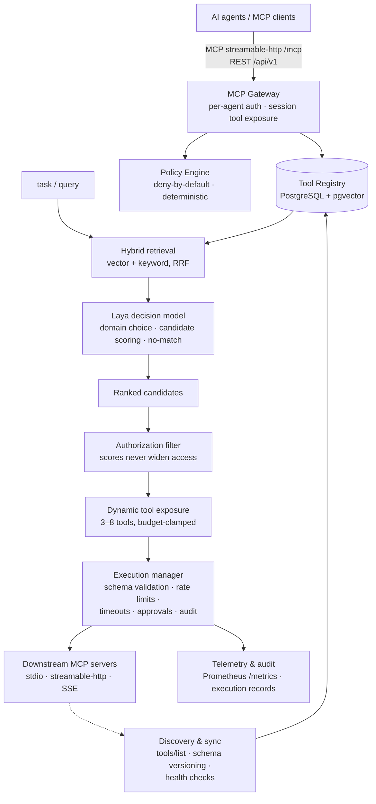

# MCP Router

**An open-source, Jev-based MCP router with edge capacity.** It discovers,
catalogs, classifies and deduplicates every MCP server and tool you have — then
exposes each AI agent only the small, relevant, *authorized* subset it needs for
the task at hand, instead of flooding its context window with the whole catalog.

*Jev-based* means routing decisions are **System One decisions** — typed
Choice / Score / Noul questions answered with calibrated probabilities in a
single forward pass, the paradigm introduced by
[TypeSafe's Jev](https://docs.aimlapi.com/api-references/decision-models/typesafe/jev) —
rather than generated text. The decision engine is pluggable: run it **at the
edge** on a laptop GPU or CPU, point it at a **hosted endpoint** (Jev, or
another MCP Router serving its local model), or use **Azure OpenAI** with a URL
and key. See [Backends](#backends).

- **Default decision engine:** [Laya](https://huggingface.co/convaiinnovations/laya) —
  a 421M open-weight, Jev-compatible decision model (Apache 2.0). Because a
  decision model can only *select among options supplied by deterministic
  code*, it structurally cannot invent tool names or execute anything.
- **Retrieval:** BGE-small embeddings in PostgreSQL + pgvector, fused with
  Postgres full-text keyword search (reciprocal-rank fusion).
- **Security:** a deterministic, deny-by-default policy engine and execution
  manager. Model scores are relevance data — they can never widen access.
- **Exposure budgets + route cache:** per-request, per-agent and global caps on
  exposed tools *and* distinct servers (a request can lower a budget, never
  raise it); a generation-invalidated route cache that re-checks
  authorization on every hit.
- **Efficiency analytics (the funnel):** every routing decision is followed
  through *surfaced → selected → succeeded*, with execution-to-decision
  attribution, position bias, context-token savings vs. the agent's full
  authorized catalog, per-agent profiles, wasted-exposure and staleness
  suggestions, daily rollups and Prometheus totals. Admin simulations are
  excluded; cache hits count as real traffic.
- **Dashboard:** a tool **playground** (schema-generated forms, runs through
  the same execution manager over `POST /api/v1/tools/{id}/execute`), an
  approvals queue, the **agent lens** (see exactly what one agent would be
  shown for a query, with every budget clamp and policy filter explained),
  and the analytics funnel.
- **Zero-ML fallback everywhere:** the entire stack runs with no torch
  installed (hash embeddings + lexical decision model), and any model failure
  or timeout degrades to deterministic retrieval ranking, flagged
  `fallback_used`.

### Skills (v0.4)

[Agent Skills](https://agentskills.io/specification) are routed like tools,
through one pipeline and one policy engine:

- **Sources:** register a local directory or an https git repo. Git sources
  are shallow-cloned with hooks off and size and time caps. Ingest checks each
  skill against the spec and flags secret-shaped or oversize content without
  editing it.
- **Risk class:** each skill is classed `read`, `write`, `execute` or `unknown`.
  Shipping `scripts/` or exec-like `allowed-tools` makes a skill `execute`, and
  policy treats `unknown` as `execute`. Human review is respected, but a content
  change re-opens it.
- **Routing:** `/route` returns `skills[]` under a separate `maxSkills` budget.
  Policy rules use `resourceKind: "skill"`.
- **Exposure:** a skill is exposed only if it was routed to the agent. Clients
  receive it as MCP prompts and resources, through the meta-tools
  `router.activate_skill` and `router.read_skill_resource`, or over REST
  activate or bundle (a zip for `~/.claude/skills`). Every activation is
  policy-checked and audited, and the funnel tracks it as
  *surfaced → activated*.
- Operator guide with flow diagram: [`docs/skills.md`](docs/skills.md).

Target hardware: a single laptop GPU (RTX 4060 Laptop, 8GB) with full CPU
fallback. Runs entirely offline; no external inference services.

## Backends

The decision model is pluggable via `MCPR_DECISION_BACKEND`:

- `laya` (default) — local model, GPU if available.
- `deterministic` — no model; also the automatic fallback on any backend error.
- `remote` — hosted Jev (AIML API) or **another MCP Router's** `POST /api/v1/decision/systemone` edge endpoint.
- `aoai` — Azure OpenAI v1 (decision), plus `MCPR_EMBEDDING_BACKEND=aoai` for embeddings.

Outbound endpoints are https-only (http only to localhost), link-local/metadata targets are refused, keys are never logged, and every call has a total deadline. Full matrix, env examples, wire shapes and the edge topology: [docs/backends.md](docs/backends.md).

## Architecture



### Routing pipeline (FR-03/FR-04)

```mermaid
sequenceDiagram
    participant Agent
    participant API as /api/v1/route
    participant Scope as Policy scope filter
    participant Ret as Hybrid retriever
    participant Laya
    participant Exec as Gateway /mcp

    Agent->>API: query (authenticated; agent_id = principal)
    API->>Scope: pre-filter: which servers/tools is this agent allowed?
    Scope-->>Ret: authorized scope only
    Ret-->>API: 10–20 candidates (vector ∪ keyword, RRF)
    API->>Laya: Choice: which domain? (only domains present)
    API->>Laya: Score each surviving candidate (batched)
    API->>Laya: Noul: does anything fit? → no_match gate
    API->>Scope: re-filter ranked list (defense in depth)
    API-->>Agent: top 3–8 tools + scores (+ fallback_used / no_match)
    Agent->>Exec: tools/list → exposed subset · call_tool → policy + validation + audit
```

A hierarchical cascade — never one big classification over the whole catalog.
Any model exception or deadline overrun falls back to deterministic retrieval
ranking; a sub-threshold "does anything fit?" probability returns an honest
`no_match` instead of garbage.

## Quickstart

```bash
docker compose up -d db                     # pgvector on :5434
uv venv --python 3.12 .venv
uv pip install -e '.[dev]'                  # zero-ML core
# optional, for real embeddings + Laya:
uv pip install -e '.[inference]'

export MCPR_ADMIN_TOKEN=$(openssl rand -hex 24)
export MCPR_AGENT_KEYS="my-agent:$(openssl rand -hex 24)"
.venv/bin/uvicorn --factory mcprouter.api.app:create_app --port 8400

cd ui && npm ci && npm run dev              # dashboard on :5180
```

Register servers via the dashboard or `POST /api/v1/servers` (admin token),
import an existing Claude-Desktop-style `mcpServers` config via
`POST /api/v1/servers/import`, then point your agent at `http://host:8400/mcp`
with its API key.

**Install into your coding agent:** see [docs/INSTALL.md](docs/INSTALL.md) for
verified configs for Claude Code, GitHub Copilot CLI, Codex CLI, Cursor,
VS Code and Gemini CLI, plus identity and policy setup and troubleshooting.

Analytics rollups: set `MCPR_ANALYTICS_ROLLUP_ENABLED=true` to recompute
the daily funnel rollups inside the app (a pass at startup, then every 24h),
or leave it off and run `POST /api/v1/analytics/rollup` (admin token) from
cron once a day. Either way, days that were never rolled up are computed live
from raw rows — rollups only make old windows faster. Run `ANALYZE` after
bulk imports.

Want a synthetic fleet to play with? `python -m testbed.serve --servers 10`
spins up realistic MCP servers with overlapping tools across five domains.

## Status — honest ledger

| Verified (ran here, CPU) | Pending (needs the target GPU) |
|---|---|
| 1277 backend + 111 UI tests green; e2e: discover → route → execute → audit → analytics funnel | CUDA/FP16 paths (written, device-agnostic, unproven) |
| Laya 0.4.0 loaded on CPU: choice/score/noul with calibrated probs | <150ms warm routing p95 |
| 100 servers / 1,000 tools full refresh in 6.1s (target: <60s) | <4GB VRAM claim |
| Zero unauthorized executions across the adversarial test battery | Laya candidate-count tuning (score top-5 vs top-20) |
| Skills e2e (`tests/test_e2e_skills.py`): source sync → classify → route → MCP prompt → bundle → analytics; synthetic baseline (fallback): skills top-1 1.0 / top-5 1.0, mixed 0.75, 0 unauthorized skill exposures | |
| 100+ security guards mutation-checked (break guard → named test fails) | |

The GPU validation runbook is [`docs/hardware-validation.md`](docs/hardware-validation.md).

## Security model

Authentication (per-agent API keys, hashed at rest) → deny-by-default policy
rules with `read < write < execute` ceilings (an unclassified tool counts as
`execute` — fail closed) → JSON-Schema argument validation → optional
human approval gates (single-use, expiring) → timeouts and per-agent rate
limits → an audit record for every attempt, including refusals. Secrets are
redacted before logs, audit rows and model inputs. Details:
[`docs/security-model.md`](docs/security-model.md).

> ⚠️ Registering a **stdio** server means the platform will run that command.
> Server registration is therefore admin-only and the admin API fails closed
> when no `MCPR_ADMIN_TOKEN` is configured. Don't expose the API beyond
> localhost without auth configured.

## Repository map

```
src/mcprouter/
  mcpclient/   MCP SDK 2.x connectors (stdio · streamable-http · SSE)
  discovery/   tools/list sync, schema versioning, health, config import
  registry/    catalog search, classification + human review, usage stats
  dedup/       duplicate detection → human-reviewed suggestions (never auto-disable)
  inference/   hash + BGE embeddings · Laya adapter · deterministic fallback · engine
  routing/     hybrid retrieval · hierarchical pipeline · no-match gate ·
               exposure budgets · route cache · simulate traces
  policy/      deny-by-default rules engine + scope filter
  execution/   validation · approvals · rate limits · redaction · audit
  gateway/     per-agent MCP endpoint with dynamic tool exposure
  analytics/   funnel · attribution · context economy · profiles · rollups · metrics
  eval/        routing-quality framework + synthetic dataset (77 cases)
  skills/      skill sources (directory · git) · ingest/validate · safe serving · bundle export
ui/            React + Vite + Fluent UI v9 dashboard: catalog, playground,
               approvals, agent lens, analytics funnel
testbed/       synthetic MCP server fleet with ground-truth labels
  skills/      deterministic Agent Skills generator (near-duplicates, invalid cases, git)
bench/         latency/VRAM benchmark harness + committed CPU baselines
docs/          spec · scoping · security model · skills guide · hardware validation runbook
```

## License

Apache License 2.0. Laya (Apache 2.0) and BGE (MIT) are downloaded at runtime
from their upstream repositories and are not redistributed here.
