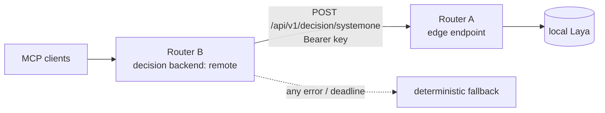

# Inference backends

MCP Router's decision model (choice / score / noul) and embedding model are
pluggable. The engine wraps every decision backend in `DeadlineDecisionModel`
and falls back to the deterministic model on any typed backend error.

## Matrix

| `MCPR_DECISION_BACKEND` | Where it runs | Wire | Notes |
|---|---|---|---|
| `deterministic` (default) | local | — | no model; always available; the fallback |
| `laya` | local, in-process | — | needs the `[inference]` extra (or the inference image); GPU if present, CPU otherwise |
| `remote` | hosted Jev (AIML API) **or** another MCP Router | `POST https://api.aimlapi.com/v1/decisions` / `POST https://<router>/api/v1/decision/systemone` | System One decision shape |
| `aoai` | Azure OpenAI (v1 API) | `POST {endpoint}/openai/v1/chat/completions` | strict JSON-schema output |

Embeddings (`MCPR_EMBEDDING_BACKEND`): `hash` (default; zero-ML hash projection),
`bge` (local BGE-small, needs `[inference]`) or `aoai` →
`POST {endpoint}/openai/v1/embeddings`. Any other value stops startup.

## Configuration

```bash
# Remote: hosted Jev
MCPR_DECISION_BACKEND=remote
MCPR_DECISION_ENDPOINT=https://api.aimlapi.com/v1/decisions
MCPR_DECISION_MODEL=typesafe/jev
MCPR_DECISION_API_KEY_FILE=/run/secrets/aiml_key   # or MCPR_DECISION_API_KEY
MCPR_DECISION_MAX_RETRIES=2

# Remote: another MCP Router's edge endpoint (LAN)
MCPR_DECISION_BACKEND=remote
MCPR_DECISION_ENDPOINT=https://router-a.lan/api/v1/decision/systemone
MCPR_DECISION_API_KEY_FILE=/run/secrets/router_a_key

# Azure OpenAI (decision and/or embeddings)
MCPR_DECISION_BACKEND=aoai
MCPR_EMBEDDING_BACKEND=aoai
MCPR_AOAI_ENDPOINT=https://<resource>.openai.azure.com
MCPR_AOAI_API_KEY_FILE=/run/secrets/aoai_key        # or MCPR_AOAI_API_KEY
MCPR_AOAI_CHAT_DEPLOYMENT=gpt-4o-mini
MCPR_AOAI_EMBEDDING_DEPLOYMENT=text-embedding-3-small
MCPR_AOAI_MAX_RETRIES=2
```

Prefer the `_FILE` variants: the key never appears in the process environment.

## Verified wire shapes

**Jev / System One** (source:
<https://docs.aimlapi.com/api-references/decision-models/typesafe/jev>, re-fetched
2026-10-08). `POST https://api.aimlapi.com/v1/decisions`, `Authorization: Bearer <key>`,
body `{"model", "state", "questions": {key: {"type", "instructions", "criteria"}}}`;
response `{"model", "answers": {key: ...}, "usage"}`. The response `model` is a versioned
id (`typesafe/jev-1.13-20260917`) and is not compared. `noul` criteria are optional
(none sent). The limit is 32K tokens; an over-long state returns a 4xx → typed error →
fallback. An MCP Router edge endpoint speaks the same shape.

**Azure OpenAI v1** (sources:
<https://raw.githubusercontent.com/Azure/azure-rest-api-specs/main/specification/ai/data-plane/OpenAI.v1/azure-v1-v1-generated.json>,
<https://learn.microsoft.com/en-us/azure/foundry/openai/api-version-lifecycle>). Base
`{endpoint}/openai/v1`, no `api-version`, header `api-key`. Chat: `model`=deployment,
`temperature`, `max_completion_tokens`, `response_format={"type":"json_schema",
"json_schema":{"name","schema","strict":true}}`. Embeddings: `{model, input:[str],
dimensions}` (`dimensions` only on text-embedding-3+); response `data[i] = {index,
embedding, object}`.

## Caveats

- **AOAI `score_batch` = N requests**, sequential, one per item.
- **Jev `score` is a float**; the router maps it to the nearest level (argmax).
- **Strict-mode enum size** (believed, not verified): very large choice lists may be
  rejected by Azure with HTTP 400 → `DecisionRuntimeError` → deterministic fallback.
  Choice probabilities are an array aligned with option order (strict mode forbids
  open-keyed objects).

## Security posture

- Outbound URLs (`urlcheck.validate_outbound_url`, shared by remote and AOAI) are
  **https-only**, except plain http to `localhost`/`127.0.0.1`/`::1` for remote (AOAI is
  always https). Credentials-in-URL and fragments are refused.
- **Link-local and cloud-metadata targets are refused**, including alternative encodings:
  decimal/hex/octal IPv4, IPv4-mapped/-compatible IPv6, NAT64 `64:ff9b::/96`, NAT64
  local-use `64:ff9b:1::/48`. DNS names are not resolved at validation time (residual).
- **RFC 1918 / ULA addresses are allowed** so a LAN edge router works.
- AOAI hosts must end in `.openai.azure.com` / `.services.ai.azure.com` with an ASCII
  `[a-z0-9-]` resource label.
- **Keys are never logged**, never in error messages, and never left in a stack frame
  local on the error path. Upstream bodies are not echoed. State text is redacted before
  it leaves the process.
- **Deadlines**: each call has one total deadline; every attempt gets the remaining
  budget as its timeout and a retry that would overrun it is refused. Remote also has an
  inner hard-stop timer against header trickling; `DeadlineDecisionModel` is the outer bound.
- **Response caps**: 1 MiB body, JSON depth 20.
- The Health page shows backend kind, model/deployment and endpoint **host** only.

## Edge pattern

Router A runs local Laya and exposes `POST /api/v1/decision/systemone` (auth required,
rate-limited, request size/depth capped). Router B sets `MCPR_DECISION_BACKEND=remote`
pointing at A, so a GPU-less host borrows A's model.



**Loop guard**: every outbound `remote` decision call carries
`X-MCPR-Decision-Hop: n+1` (n = hops the current request has already travelled, 0 when
it started here). An edge refuses (503) a request that arrives with hop >= 1 when serving
it would forward again (its own backend is `remote`); a malformed hop header counts as
forwarded. MCPR→MCPR chains are therefore at most one hop, so A→A and A→B→A loops are
refused whatever hostnames or ports are involved. Belt-and-braces: a `remote` router also
refuses when its configured endpoint is its own listener (host:port or a localhost alias).
Residual: only a non-MCPR intermediary that **strips the header** can hide a loop; the
per-request deadline still bounds it.
